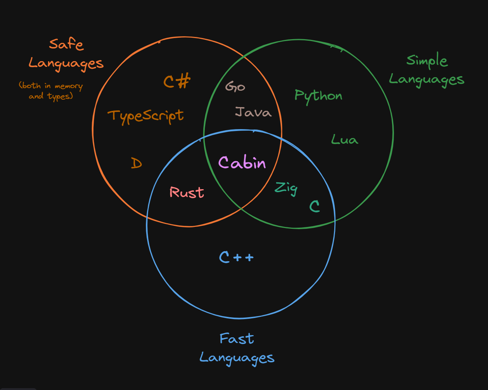

# Cabin

**Warning: Cabin is in pre-alpha. It is still in active development and *won't* work, not even for small or experimental projects. Note that items that are not checked off are either currently unfinished or not even started.**

A dead simple, highly performant, extremely safe programming language.

## Installation

**Please read the `## Syntax Gotchas` section under `# Limitations` before using Cabin to avoid confusion.**

Cabin is not yet available for installation, because it's *that* early on. It will release in 0.1 for alpha testing.

## Philosophy & Motivation

Cabin has three "core values":

- Simplicity
- Safety
- Performance

Above all else, Cabin aims to be a dead simple language that anyone can learn in almost no time, while not compromising on performance or safety.

Cabin aims to fill the "missing hole" in the intersection of these three values:



There are other attempts to fill this hole as well, such as Nim and V. This is just one of them.

Cabin is primarily inspired by Lua, Rust, Go, Zig, and V.

## Niceties

Cabin has several features that makes it attractive. Below are just some examples.

### Tooling

By default, the Cabin compiler comes with all of the tools you need to feel comfortable in the language:

- [x] Project Creator: Creates new Cabin projects with a set up config file and source folder.
- [x] Runner: Runs Cabin code without outputting any permanent files
- [x] Compiler: Compiles Cabin code to native binary executable
- [x] Formatter: Formats Cabin code to a single unified style
- [x] Transpiler: Transpiles Cabin code to C
- [ ] Linter: Provides code diagnostics including errors, warnings, hints, and information.
- [ ] Package Manager: Manages Cabin dependencies, publishes cabin packages, etc.

Specific documentation about these tools is below. Additionally, language support extensions for Cabin are available for most popular text editors:

- [ ] Visual Studio Code: [vscode-cabin](https://github.com/cabin-lang/vscode-cabin)
- [ ] Neovim: [cabin.nvim](https://github.com/cabin-lang/cabin.nvim)
	- [ ] The Cabin language server available is in `mason.nvim`
	- [ ] The Cabin treesitter parser is available through `nvim-treesitter`
- [ ] Vim: vim-cabin

### Detailed and Readable errors

Cabin generates very detailed and human-readable errors at the command line:


And here's another example:


The errors show what happened, including the trace of what the compiler was doing leading up to that point. Additionally, a colored code snippet is provided showing the location of the error, which is bold, underlined, and highlighted in red in the code, as well as pointed at with some arrows telling you the error is there. The error also shows the file that the error occurred on relative to your project root, and displays the line number the error occurred on in bold red. Finally, a more detailed explanation of the error is listed, including suggestions on how to fix it when possible.

Cabin does allow, through flags, more "structured" errors &mdash; i.e., errors printed in formats like JSON or TOML. This is mainly used for IDEs and linters to integrate Cabin errors as diagnostics. The default formatting mode is human readable, which will output what you can see above.

### Thoughtless Memory Management Without Garbage Collection

Cabin provides no memory semantics to the developer. That is, memory is not manually managed through things like `malloc` or `free`, there are no ownership or borrowing semantics, etc. However, Cabin **is not garbage collected**. Cabin has its own system of determining when variables need to be cleaned up at compile-time instead of runtime. You can think of it as "compile-time garbage collection" &mdash; meaning you get the benefits of garbage collection (not having to worry about memory management) without the performance hit.

### Syntactic Simplicity

Cabin has a few special syntaxes that make it generally easier to work with than other languages. For example, assigning a value in Cabin is done with a single equal sign. Also, comparing if two values are equal is *also* done with a single equal sign. This is unambiguous because assignments are *statements*, not expressions, meaning they are only available at the top level of a statement. 

Additionally, all strings are both multiline and formatted, which can take arbitrary expressions inside curly braces. Also, strings are automatically "unindented" by default, meaning leading tabs in code formatting won't appear in the string.

### Compile-Time by default

Cabin has a unique capability to be able to run code at compile-time. However, unlike most other languages with this capability (like Zig's `comptime` or Jai's `#run`), Cabin *runs code at compile-time as the default*. What this means is that if your code *can* be run at compile-time, it will be. This means Cabin can report errors that are normally completely impossible for other languages to detect, and automatically optimizes for maximum runtime performance.

Of course, if you would like to perform an action at runtime like writing a file, you can force it with the `run` keyword, which in this case would look something like `run write_file(filename, contents)`. The run keyword forces the expression after it (but not its sub-expressions!) to be run at runtime instead of compile-time. Cabin *can* write to files at compile-time, but you probably don't want to, so this is where you'd use a `run` expression. Some functions, including `write_file`, are marked with `#[runtime_preferred]`; Calling these functions at compile-time will give a (suppressable) warning that you're calling a function at compile-time which is typically used at runtime.

You can think about "what can be run at compile-time" as a tree &mdash; The arguments passed to a Cabin program at the command-line aren't known at compile-time. The expressions that depend on those arguments are thus also not evaluated at compile-time. The expressions that depend on the results of *those* expressions are also not evaluated at compile-time, and so on. Any expression in the expression tree that doesn't rely on user input can be and will be evaluated at compile-time.

One of the nice features about Cabin's compile-time code compared to Zig's is that Cabin uses a unified API to run compile-time code and runtime code. For example, to read a file at compile-time in Zig, you use `@embedFile`, but to read a file at runtime, you do something along the lines of `try std.fs.cwd().openFile(filename, .{});` and read it with a reader from there. In Cabin, the API is the same: You do `read_file(filename)` to read a file at compile-time or runtime, which is just a regular Cabin function that, like all functions in Cabin, can be called at runtime or compile-time. This means you don't need to remember two different ways of doing the same thing.

### Safety to the Max

Cabin is designed to be extremely safe, both in memory and in types. In terms of type safety specifically, Cabin makes no compromises. In Cabin, you can't assign `null` (what we call `nothing`) to any type; You must specify that the type is a union of some other type or `nothing`. Cabin is also statically typed, so there doesn't exist any sort of "type error" or "missing property error" at runtime at all.

In fact, Cabin doesn't have runtime errors *at all*. Part of the philosophy of Cabin's functional style is that each function should be responsible for doing whatever it's job is, and when something goes wrong, it should just report that back to the caller (return an error). There is no immediate panicking or exiting the program; No one function should have the power to determine what to do with the entire program when an error is encountered; Instead, it should simply pass the error up the error stack. You can do this repeatedly for functions in functions, and only when the global scope (or "main function" if you'd like to think of it that way) encounters an error will the program actually terminate.

Furthermore, memory unsafety doesn't exist in Cabin. It's impossible to memory leak. It's impossible to have a dangling reference. No, it's not garbage collected.

### Error Handling

Cabin has a unique error handling system that's essentially Rust-style errors-as-values juiced up on steroids. The core idea is the same as Rust: Errors are values, just like any others, and have to be handled as such. Here's were the Cabin magic comes in: If a function called at compile-time returns an error value, you get a compile-time error automatically. If there is no compile-time error that occurs, the value is automatically unwrapped into the success value.

For example, consider indexing into a list:

```cabin
list[index]
```

This normally returns a `Result` value that you have to pattern match on before using, because the index could be out of range. For example:

```cabin
list[index].some_field // Invalid! This is a Result, and may not be the Ok value

// Instead:
match list[index] {
	value: String => terminal.print(value);
	error: Error => terminal.print(error);
};
```

However, Cabin lets you simplify this &mdash; If the index expression is called at compile-time and the list as well as the index are known at compile-time, the entire index expression is evaluated at compile-time, and the error will only manifest itself as a compilation error. Which means this is valid Cabin under those conditions:

```cabin
list[index].some_field
```

This follows the Cabin philosophy &mdash; the way to do something at compile-time is the same way it's done at runtime. For example, in Zig you'd return an `error.Something` at runtime, and use `@compileError` at compile-time. In Cabin, it's the same either way, you just return an error.

## Tooling Reference

By default, the Cabin compiler comes with the following tools:

- [x] Project Creator: Creates new Cabin projects with a set up config file and source folder.
- [x] Runner: Runs Cabin code without outputting any permanent files
- [x] Compiler: Compiles Cabin code to native binary executable
- [x] Formatter: Formats Cabin code to a single unified style
- [x] Transpiler: Transpiles Cabin code to C
- [ ] Linter: Provides code diagnostics including errors, warnings, hints, and information.
- [ ] Package Manager: Manages Cabin dependencies, publishes cabin packages, etc.

### Runner

Using `cabin run <filename.cbn>` will run a single Cabin file. Under the hood, this transpiles the code to C, stores that in a temporary file, transpiles the C code to a native executable, stores *that* in a temporary file, then runs the native executable and removes both the files. This allows running code without having to save it anywhere in particular.

If `cabin run` is used without a file name as the argument, it will assume you are in a Cabin project, and run the project, using the configuration file (`./cabin.toml`) and using `src/main.cbn` as the main file to run.

Options:
- `--quiet` or `-q` [bool]: Runs the cabin file in "quiet" mode. This won't print progress updates about parsing or tokenization, but will still print errors.
- `--emit-c` or `-c` [filename]: Emits transpiled C code to the given file.

### Compiler

Using `cabin build <filename.cbn> <output>` will compile a single Cabin file into a native binary executable. Under the hood, this transpiles the Cabin code into C, compiles the C code into the native executable (at `<output>`), and then removes the temporary C file. If no argument is supplied for `<output>`, the default is to name the output `<filename>` (the name of the source file without `.cbn`) and place it in the same location as the source file.

If `cabin build` is used without any additional arguments, it will assume you are in a Cabin project, and build the project, using the configuration file (`./cabin.toml`) and using `src/main.cbn` as the main file to build.

Options:
- `--quiet` or `-q` [`bool`]: Runs the cabin file in "quiet" mode. This won't print progress updates about parsing or tokenization, but will still print errors.
- `--emit-c` or `-c` [filename]: Emits transpiled C code to the given file.

### Formatter

Cabin comes with a single un-opinionated formatter built in with `cabin format <filename.cbn>`. This will format a single Cabin file. Running `cabin format` without a file argument will assume you are in a Cabin project and format all files in the project. There are *not* options that can be passed to customize formatting, and this is by design. All Cabin code looks the same.

- `--quiet` or `-q` [`bool`]: Runs the cabin file in "quiet" mode. This won't print progress updates about parsing or tokenization, but will still print errors.

### Transpiler

Cabin can be transpiled into C code. It won't be beautiful C code, but it is human-readable enough. This is done with `cabin transpile <filename.cbn> <output.c>`, which will transpile the code in `filename.cbn` and output the equivalent C into `<output.c>`. If no output is specified, the file will be named `filename.c` (the name of the original source file with a `.c` extension instead of `.cbn`).

Options:
- `--quiet` or `-q` [`bool`]: Runs the cabin file in "quiet" mode. This won't print progress updates about parsing or tokenization, but will still print errors.
- `--to` [`language`]: Transpiles Cabin to the given language. Currently only C is supported.

### Linter

Cabin comes with a built-in linter via `cabin check`. The Cabin linter has two modes that can be changed between: Developer mode and release mode. Developer mode provides basic lints such as compiler errors. Release mode provides *exhaustive* lints for production-ready code, down to things as pedantic as missing documentation. Developer mode is the default for the linter mode, and in many IDEs and text editors, you can switch between the two modes with a keybinding. 

Options:
- `--mode` or `-m` ["develop" | "release"]: The mode to lint the project in.
- `--format` ["json" | "toml" | "yaml" | "human"] (default "human"): The format to output the results in. Passing "human" (the default) will output pretty, human-readable diagnostics. To get structured diagnostics for IDE integration, use `json`, `toml` or `yaml`.

### Package Manager

The Cabin toolchain has several commands for package management:
- `cabin add <package>` - Adds a dependency to the package.
	- `--version` or `-v` - Adds a specific version of the dependency
- `cabin remove <package>` - Removes a dependency from the package.
- `cabin publish` - Publishes a package. Options:
	- `--major` or `-M` - Increments the version number by 1.0.0 automatically
	- `--minor` or `-m` - Increments the version number by 0.1.0 automatically
	- `--patch` or `-p` - Increments the version number by 0.0.1 automatically

## Limitations

While Cabin was designed to give certain specific benefits, some of them come with drawbacks. Some are listed here.

### Syntax Gotchas

Cabin's syntax makes a few compromises to be as terse and expressive as it is. For example, when comparing things with less-than and greater-than, you must use spaces around the comparison operator:

```cabin
if a<b { ... } // Not valid
if a < b { ... } // Valid
```

While this may seem arbitrary, this is necessary to be able to distinguish what's a function call or parameterized group from a comparison. For example, consider this case:

```cabin
if a<b and c>(d) { ... }
```

this could be a function called `a`, with a compile time parameter of the expression `b and c`, and a runtime parameter `d`, or, this could be checking if `a < b` and `c > d`. This is ambiguous and the compiler has no way of knowing what you're trying to do here. So, We require that you use spaces around comparison operators and no spaces around compile-time parameters:

```cabin
foo < hi > // Not a valid function call
foo<hi> // Valid!
```

This is standard formatting anyway, but whitespace-sensitivity can definitely be confusing and a "gotcha" for some people, so it's good to make note of.

### No Caching

Your code needs to be recompiled, every time, even if it's completely unchanged. Well, not *entirely* - We can skip everything after compile-time evaluation (which is transpilation into C code and compiling the C code), but your program always needs to be re-tokenized and parsed, even if it's unchanged. Most languages can store the binary executable and check if your program is unchanged, and just rerun the executable if it is. However, in Cabin, the final binary executable doesn't contain all of the information about the program - notably compile-time code. For example, if your code prints something during compile-time, this won't be present in the final executable, and running the same code a second time would yield different results because the compile-time code won't be run and nothing will be printed. This is more confusing than caching is worth, so for now, we can't fully cache a pre-compiled program.

It's not impossible though; In theory we could serialize the parsed AST and then deserialize it into an AST in the code if the program's unchanged, but this isn't really high on our priority list. Serialization is tricky because of the recursive nature of the AST, and there's not even definitive proof that it'd always be faster than just recompiling (is reading a serialization file and parsing the data in it into an AST faster than just tokenizing and parsing the code itself? Who's to say?). So, for now, this isn't high on our list, and your code needs to be completely recompiled from scratch every time its run, even if it's completely unchanged from the last run.

### User-Based Conditional Compilation

The compiled executable can be different depending on user input at compile-time. For example, you can call the `terminal.input` function at compile-time, and do something with the result at compile-time, and the resulting executable can be different for different people that compile it. For this reason, some functions such as `terminal.input` are marked with `#[runtime_only]`, which means the compiler will emit a warning if it's called at compile-time instead of runtime. However, this is only a warning, not a hard error. Part of Cabin's philosophy on being simple is to not make special exceptions, so all functions can be run at compile-time, including functions like `terminal.input`. The warning discourages but does not prevent compilation to different executables based on user input or the user's environment (such as reading a file at compile-time) during compilation. The functions where this can be problematic, like `terminal.input` and `file.read`, are marked `#[runtime_only]` to discourage running them at compile-time.

### Compilation Speed Limited by C

Currently (though maybe not forever), Cabin compiles to C before being compiled to a native binary. This means that *no matter how optimized the compiler is, it will always be at least slower than C* (at compiling). This isn't a huge deal because modern C compilers are optimized really well to be really fast, but it's worth noting that this strict lower bound currently exists, and that with the current compilation system Cabin could never beat C in this department.